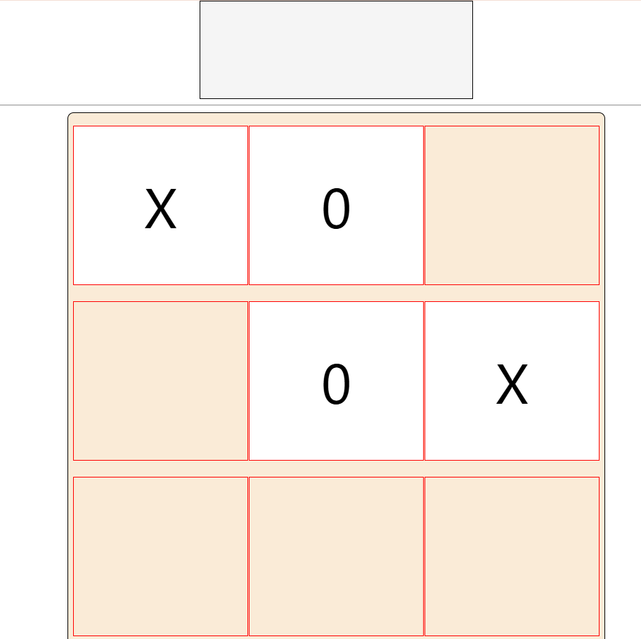

# Tic-Tac-Toe 🎲



A simple, interactive Tic-Tac-Toe game built with HTML, CSS, and JavaScript. Play against a friend and enjoy a classic game with a smooth, responsive interface.

## 📜 Features

- **Interactive Game Board**: Click on any cell to mark it with `X` or `O`.
- **Automatic Win Detection**: The game checks for a winner or draw condition after each move.
- **Stylish Interface**: Clean, minimalistic design with color highlights on user moves.
- **Auto-Reload**: After the game ends, the page automatically reloads to start a new game.

## 📂 Project Structure

```plaintext
Tic-Tac-Toe/
├── index.html       # Main HTML file for the game interface
├── style.css        # CSS file for styling the game board
├── index.js         # JavaScript file for game logic and interactivity
└── README.md        # Documentation file (this file)
```

## 🛠️ Setup Instructions

1. **Clone the repository**:
   ```bash
   git clone https://github.com/iamrajanjharj/Tictactoe.git
   ```
2. **Navigate to the project directory**:
   ```bash
   cd tic-tac-toe
   ```
3. **Open `index.html` in a browser** to start the game.

## 🎮 How to Play

1. **Click** on any cell in the 3x3 grid to place either `X` or `O`.
2. **Alternate turns** between two players.
3. The game checks for a winner after every move. A winning line can be:
   - Horizontal
   - Vertical
   - Diagonal
4. When a player wins or the game ends in a draw, a message is displayed, and the game automatically resets.

## 💻 Code Snippets

Here's a snippet of the JavaScript used to handle the win-checking logic:

```javascript
function checkWinner(ch) {
  const winnerByRow =
    (arr[0] === ch && arr[1] === ch && arr[2] === ch) ||
    (arr[3] === ch && arr[4] === ch && arr[5] === ch) ||
    (arr[6] === ch && arr[7] === ch && arr[8] === ch);

  const winnerByCol =
    (arr[0] === ch && arr[3] === ch && arr[6] === ch) ||
    (arr[1] === ch && arr[4] === ch && arr[7] === ch) ||
    (arr[2] === ch && arr[5] === ch && arr[8] === ch);

  const winnerByDiagonal =
    (arr[0] === ch && arr[4] === ch && arr[8] === ch) ||
    (arr[2] === ch && arr[4] === ch && arr[6] === ch);

  return winnerByRow || winnerByCol || winnerByDiagonal;
}
```

This function checks all possible winning combinations and returns `true` if there's a winner.

## 📜 License

This project is open source and available under the [MIT License](LICENSE).
